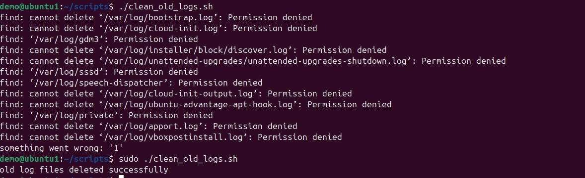
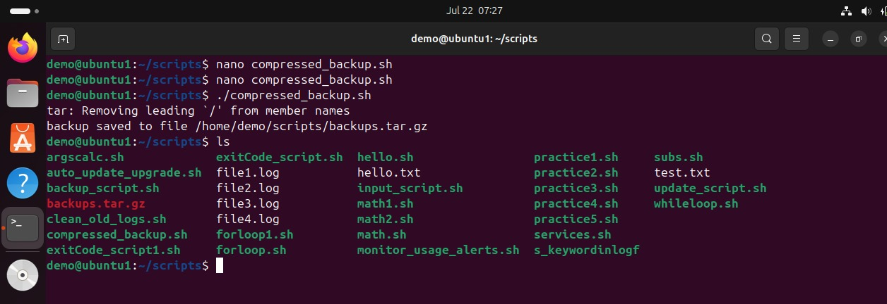
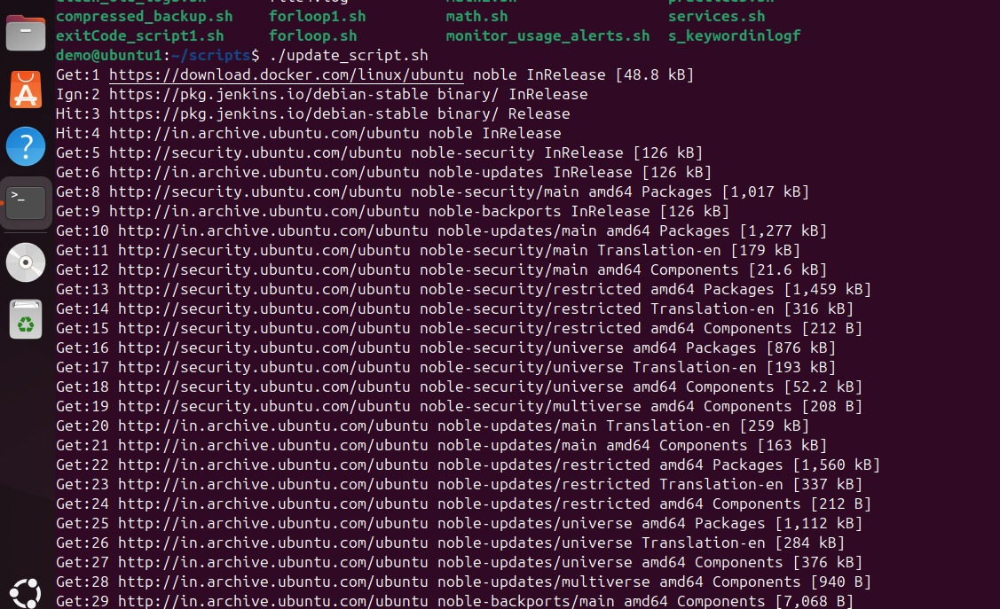
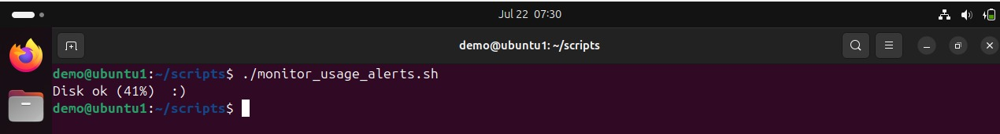
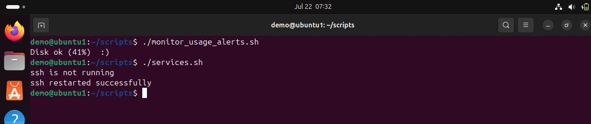

# Linux Admin Task Automation

This project automates common system admin tasks using Bash scripts:
- Log cleanup
- Directory backups
- System updates
- Disk monitoring
- Service health checks

Each script can be run manually or scheduled using cron jobs.

## Getting Started
1. Make scripts executable: chmod +x *.sh
2. Edit paths and thresholds as per your system.

## Author
sachin patkari - DevOps Fresher

IMAGES

